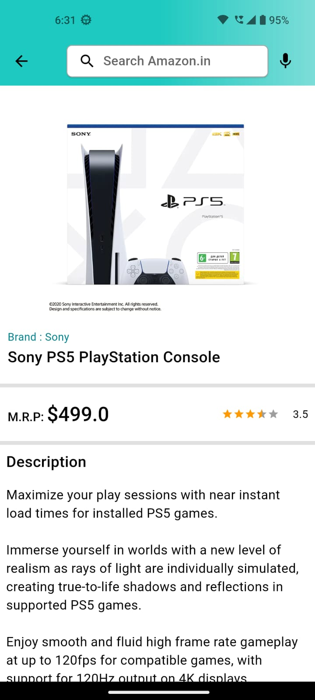
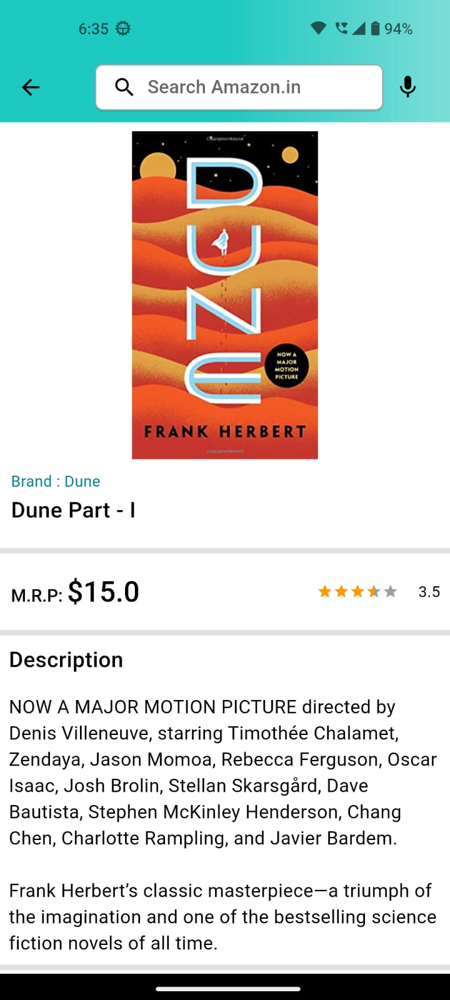
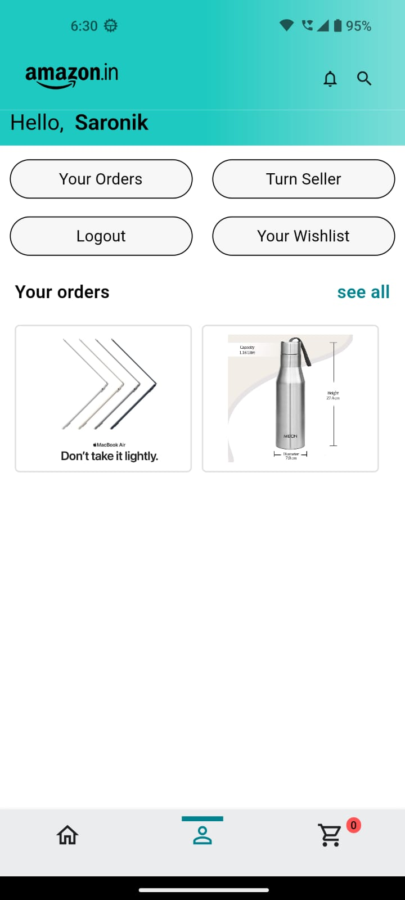
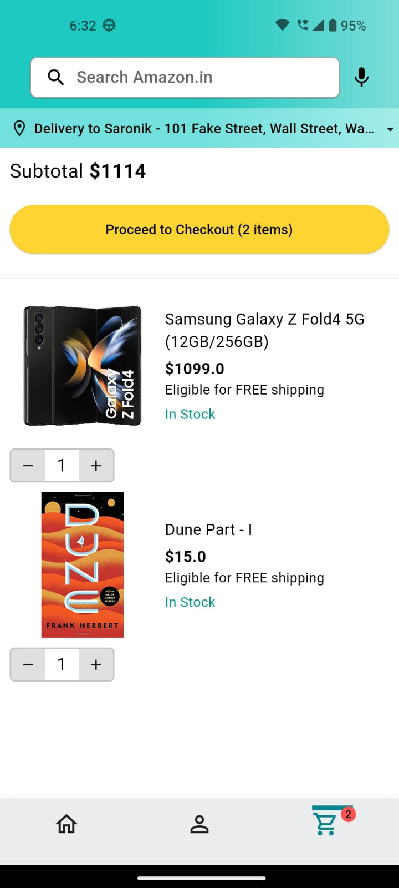
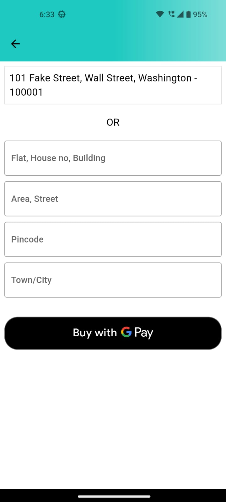
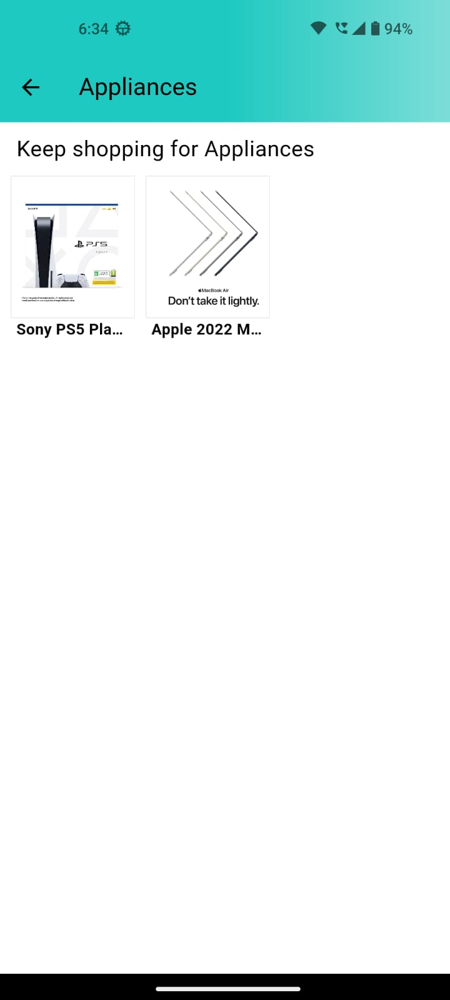

# amazon_clone

An amazon clone made in Flutter. It uses a NodeJS server as backend, also MongoDB and Cloudinary(for image storage) as databases.

## Features

- Login/Create account using your email address.
- Browse products of various categories
- Dynamic Deal-of-Day based on product ratings
- Add products to cart
- Increase/Decrease products from cart
- See order details after ordering
- Add address for payment
- Payment using GPay
- Admin Panel
- Add products via admin panel, see analytics chart also order details

## Screenshots

    <br>
  

## Getting Started

## Installation

After cloning this repository, navigate to the `amazon-clone` folder. Then, follow these steps:

1. Create a MongoDB project.
2. Choose native drivers and follow the steps mentioned there.
3. Put the url in the index.js file.
4. Configure and setup a Cloudinary account and copy and paste the public id.
5. Put the public id in the admin_services.dart file. 
4. Run the node server using 
    ```
    npm run dev
    ```

Finally, run the following commands to start the app:

```bash
flutter pub get
open -a simulator
"# amazon-clone" 

```

## Getting Started

A few resources to get you started if this is your first Flutter project:

- [Lab: Write your first Flutter app](https://docs.flutter.dev/get-started/codelab)
- [Cookbook: Useful Flutter samples](https://docs.flutter.dev/cookbook)

For help getting started with Flutter development, view the
[online documentation](https://docs.flutter.dev/), which offers tutorials,
samples, guidance on mobile development, and a full API reference.
"# amazon-clone" 
